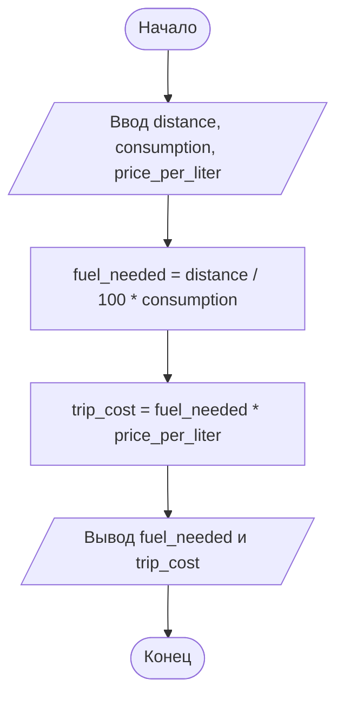

# Домашнее задание к работе 3

## Условие задачи

Написать и отладить программу расчёта стоимости поездки, исходя из известного
расстояния и стоимости бензина.

---

## 1. Алгоритм и блок-схема

### Алгоритм

1. Объявить переменные типа `double`: `distance` (расстояние, км), `consumption` (расход, л/100 км), `price_per_liter` (цена 1 л бензина), `fuel_needed` (количество бензина, л), `trip_cost` (стоимость поездки).
2. Запросить у пользователя расстояние `distance`.
3. Запросить расход топлива `consumption`.
4. Запросить стоимость 1 литра бензина `price_per_liter`.
5. Вычислить необходимое количество бензина: `fuel_needed = distance / 100.0 * consumption`.
6. Вычислить стоимость поездки: `trip_cost = fuel_needed * price_per_liter`.
7. Вывести исходные данные, расчёт и итоговую стоимость.
8. Завершить программу.

### Блок-схема



---

## 2. Реализация программы

Исходный код находится в файле dz.c.

---

## 3. Результаты работы программы

Пример работы при расстоянии **250 км**, расходе **8 л/100 км** и цене **55.50 руб./л**:

```
Введите расстояние (км): 250
Введите расход топлива (л на 100 км): 8
Введите стоимость 1 литра бензина (руб.): 55.5

РАСЧЕТ СТОИМОСТИ ПОЕЗДКИ
================================

УСЛОВИЯ:
- Расстояние: 250.00 км
- Расход топлива: 8.00 л на 100 км
- Стоимость 1 литра бензина: 55.50 руб.

РАСЧЕТ:
- Необходимо бензина: 250.00 / 100 * 8.00 = 20.00 л
- Стоимость поездки: 20.00 * 55.50 = 1110.00 руб.
================================
СТОИМОСТЬ ПОЕЗДКИ: 1110.00 руб.
```

Пояснение:

- `fuel_needed = distance / 100.0 * consumption;` — расход задан на 100 км, поэтому расстояние делится на 100 (250 / 100 * 8 = 20 л).
- `trip_cost = fuel_needed * price_per_liter;` — стоимость равна количеству бензина, умноженному на цену литра (20 * 55.50 = 1110.00).

---

## 4. Информация о разработчике

- **ФИО:** Воротников Дмитрий Романович
- **Группа:** бОТИ-261
